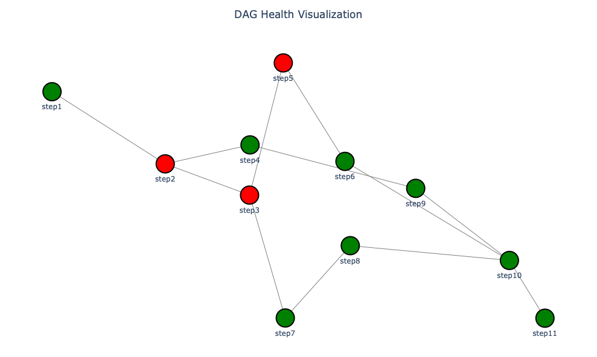
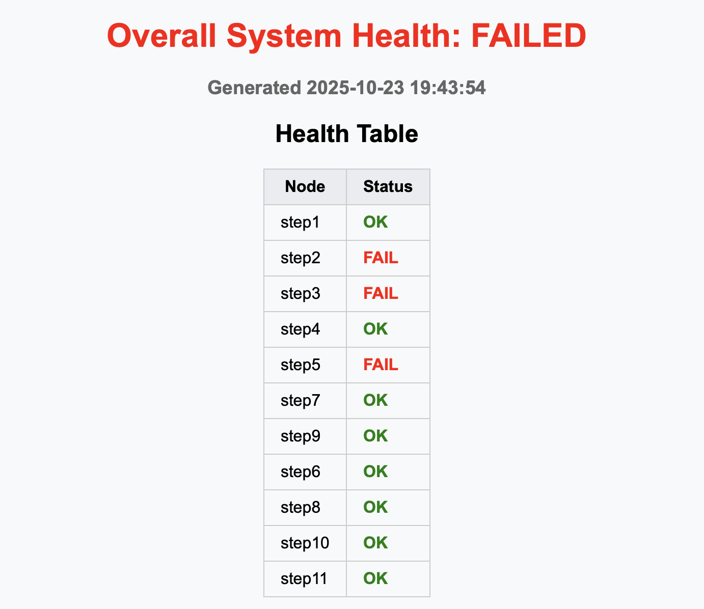

# DAG Health Checker API

This is a FastAPI that performs asynchronous health checks over a Directed Acyclic Graph (DAG) 
of system components.


# Problem: 
Develop a Python web API that checks the health of a system that
comprise of a multi-level correlated components in a Directed Acyclic Graph (DAG) form.
See a sample graph below.

# Solution:
1) Create a Python API that takes a JSON file with system relationships that translates into a DAG
2) Traverse through the graph in breadth-first search technique 
3) For each node, check for health of the component in an asynchronous way and store the result
4) Display the health of the overall system in a table format 
   5) Optional - Display the graph in a picture format and highlight the failed components in red
5) Check-in the code into GitHub and share the link when done

# Structure:
````
Schwab/
│
├── main.py                  # Main FastAPI app
│
└── utils/
    ├── plot_util.py        # Plotly DAG rendering
    └── html_header.py      # HTML and health table generation - Visualization
````

# Requirements:
Available in ```requirements.txt```

```pip install -r requirements.txt```

# How to Run?
1) Start the FastAPI server
```commandline
uvicorn app:app --reload
```
2) View the instant demo at
```commandline
http://127.0.0.1:8000/demo
```
2) For Swagger UI
```commandline
http://127.0.0.1:8000/docs
```
3) On the UI, endpoint can be tested under

```commandline
POST /check/html
```
4) View the saved report locally generated as file
```commandline
dag_report.html

open dag_report.html        # on macOS
```

# Example run:
 DAG Example

HTML Report Output

# Contact
```commandline
ushakalyani.a@gmail.com
```


